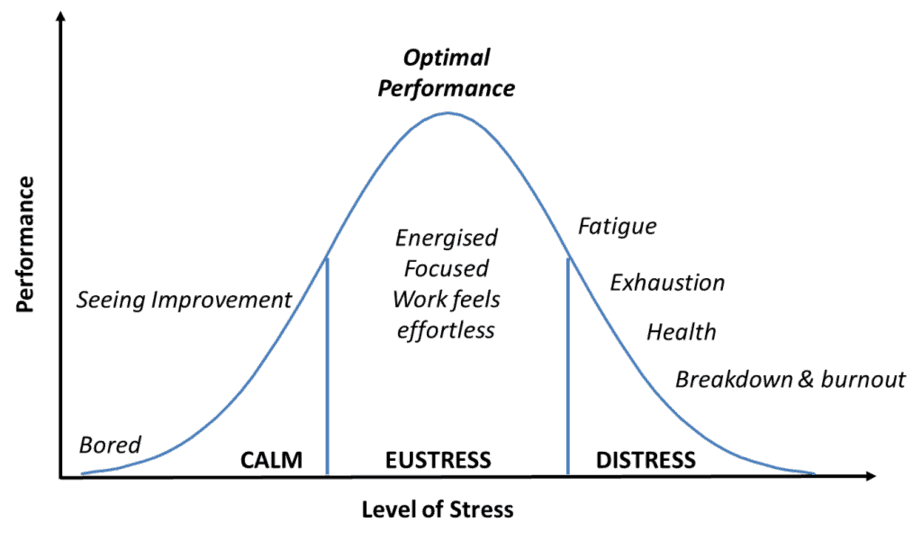

CPSC 4430 Software Engineering
==============================

About Me
--------

- Professor Craton
- Father of 2 kids - Josiah (3) and Benji (9)
- My wife's name is Karin

---

Anything you want to know about me?

Introductions
-------------

- Name
- Major(s)
- What is your favorite piece of software that you've created?

---

Quizzes
-------

- Given regularly at beginning and end of class
- 2 minute time limit
- Should be relatively easy for you
- Allow me to confirm that everyone is keeping up with course material

Syllabus
--------

[Link](../syllabus.html)

Philosophy of Grading
---------------------

- I want everyone to succeed
- Grades are one tool that I have to motivate you
    - Blunt tool
    - Prefer intrinsic motivation
    
Making Stress Your Friend
-------------------------

[Video](https://www.youtube.com/watch?v=RcGyVTAoXEU)

Effects of Stress
-----------------

Languages
---------

- What languages are you comfortable working with?

Platforms
---------

- Which platforms are you most familiar with (.NET, iOS, GTK, Android, web, etc)?

Version Control
---------------

- Which version control systems are you familiar with?
- Which of the following are you comfortable with:
    - Adding changes
    - Sharing changes between repositories
    - Creating branches
    - Merging branches
    - Navigating merge conflicts

Projects
--------

- What type of software excites you?
- What sort of systems would you be interested in working with from a learning standpoint?

Agile Values
------------

- Individuals and actions over processes and tools
- Working software over comprehensive documentation
- Customer collaboration over contract negotiation
- Responding to change over following a plan

Next class
----------

Read chapter 1
