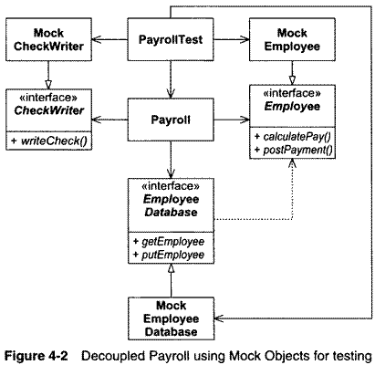
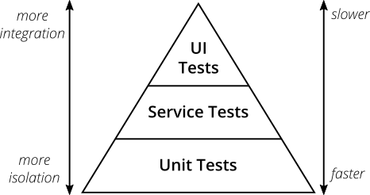

Chapter 3 - Planning
====================

Initial Exploration
===================

---

Relative time estimates

---

Story size

---

Developers should re-estimate when a story is split or merged

---

Velocity (time per point)

---

Spiking to determine initial velocity

Release Planning
================

---

Customers can see the approximate time to complete stories given a velocity

---

Decisions about what stories to complete are driven by the customer

---

Customers can't select more stories than fit based on current velocity

---

Release plan can be updated as velocity is better understood

Iteration Planning
==================

---

Customers select stories

---

Developers select story order based on technical reasons

---

Customer cannot change stories once iteration begins

---

The iteration ends on schedule, even if stories are incomplete

---

Velocity is calculated based on previous iteration

Task Planning
=============

---

Stories are broken into 4-16 hour developer tasks

---

Any developer can select any task to work on

---

Tasks are assigned task points when a developer selects it

---

Developers may not select more task points than they completed in the last iteration

---

Stories may be added or dropped in consultation with customer based on available task point budgets

Halfway Point
=============

---

Half of stories should be complete

---

Customers may pull stories if they cannot be completed

Iterating
=========

---

Customer feedback

---

Adjust stories

---

Measure velocity

---

Adjust priorities

Testing
=======

---

The act of writing a unit test is more an act of design than of verification.

---

The act of writing a unit test is more an act of documentation that of verification.

Test Driven Development
=======================

---

Write tests first

---

No code is written except that which is written to make tests pass

---

Unit testing example

Outcomes
--------

- Every function is testable
- Every function has tests
- Functions are conveniently callable

Benefits
--------

- We know when we break something
- We feel more free to make changes
- Architecture is simpler
- Architecture is decoupled

---

The act of writing tests is an act of discerning between design decisions.

Test Isolation
--------------

- Writing tests first encourages decoupling

---

Acceptance Tests
----------------

- Unit tests verify small elements of the systems (function, etc)
- Acceptance tests verify stories and features

---

Refactoring
===========

---

Refactoring is about human attention.

---

Refactoring is the difference between getting something working and getting something working right.

---

Refactoring is changing program structure without changing behavior

Purpose of a Module
-------------------

- Perform its task correctly
- Afford change
- Communicate to readers

---

We can all write correct code

---

Tests and other principles help us create code that can be changed

---

Refactoring helps us to create code that better communicates its purpose readers

Refactoring Example
===================

-----

Agile Design
============

---

The source code is the design

---

UML diagrams or other models may be used to plan or document the design

---

What goes wrong with software?
------------------------------

---

Working code is created

---

Features are added

---

Bugs are fixed

---

Code rots

Design Smells
-------------

---

Rigidity - The system is hard to change because changes cause an avalanche of change

---

Fragility - Changes cause breaks in unexpected ways

---

Immobility - It is hard to break the system into reusable components

---

Viscosity - Doing things right is harder than doing them wrong

---

Needless complexity - Design contains infrastructure that provides no benefit

---

Needless repetition - Design contains repeated structures that could be merged via abstraction

---

Opacity - Design is hard to read and does not express intent

---

- Rigidity - Hard to change
- Fragility - Easy to break
- Immobility - Hard to reuse
- Viscosity - The right way is hard
- Needless complexity
- Needless repetition
- Opacity - Does not express intent

Causes of Rot
-------------

---

Requirements change in ways that were not expected in the initial design

---

Changes need to be implemented quickly

---

Developers may not be aware of original design philosophy

Agile prevents rot
------------------

---

Agile thrives on change

---

Minimal upfront investment

---

Change is simplified and anticipated

---

Design is always appropriate for current needs

What is Agile Design?
---------------------

1. Identify problem using practices
2. Diagnose problem applying design principles
3. Solve problem using design pattern

---

Design always stays clean

---

There should not be a need to stop progress and refactor

---

Source code is the design. If the source code is not clean, the design is not clean

---

Agile design is a process, not an event

---

Principles must be followed continuously
