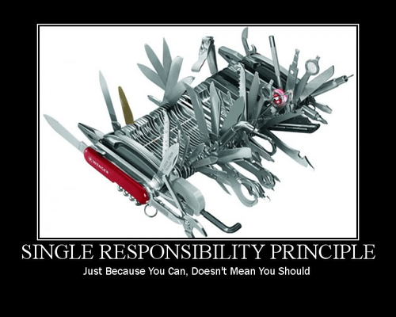

Agile Design
============

---

The source code is the design

---

UML diagrams or other models may be used to plan or document the design

---

What goes wrong with software?
------------------------------

---

Working code is created

---

Features are added

---

Bugs are fixed

---

Code rots

Design Smells
-------------

---

Rigidity - The system is hard to change because changes cause an avalanche of change

---

Fragility - Changes cause breaks in unexpected ways

---

Immobility - It is hard to break the system into reusable components

---

Viscosity - Doing things right is harder than doing them wrong

---

Needless complexity - Design contains infrastructure that provides no benefit

---

Needless repetition - Design contains repeated structures that could be merged via abstraction

---

Opacity - Design is hard to read and does not express intent

---

- Rigidity - Hard to change
- Fragility - Easy to break
- Immobility - Hard to reuse
- Viscosity - The right way is hard
- Needless complexity
- Needless repetition
- Opacity - Does not express intent

Causes of Rot
-------------

---

Requirements change in ways that were not expected in the initial design

---

Changes need to be implemented quickly

---

Developers may not be aware of original design philosophy

Agile prevents rot
------------------

---

Agile thrives on change

---

Minimal upfront investment

---

Change is simplified and anticipated

---

Design is always appropriate for current needs

What is Agile Design?
---------------------

1. Identify problem using practices
2. Diagnose problem applying design principles
3. Solve problem using design pattern

---

Design always stays clean

---

There should not be a need to stop progress and refactor

---

Source code is the design. If the source code is not clean, the design is not clean

---

Agile design is a process, not an event

---

Principles must be followed continuously

Single Responsibility Principle (SRP)
=====================================

---

A structure (class) should have only one reason to change

---

The 'S' in SOLID

---



---

Structures should be responsible for only one thing

Why?
----

- Decoupling
- Change management
- Prevents fragility and unexpected breakage

Definition of responsibility
----------------------------

Simply a reason to change

---

If an application is not changing in ways that cause different things to change at different times, there is not a need to separate them.

---

Persistence should be separate from business rules

---

---

Model-View-Controller

---


---

MVC Example

Open-Closed Principle (OCP)
===========================

---

Software entities should be open for extension but closed for modification

---

'O' in SOLID

---

Open for extension
------------------

Behavior of a module can be extended as requirements change. We can change what a module does.

Closed for modification
-----------------------

Extending behavior does not result in changes to the source or binary code of the module

---

How is this possible?

---

Abstraction
-----------

Abstract base classes

---

Software is changed by adding code rather than changing existing code

---

Example
-------

---

Wrong:

```python
class Animal():
  def walk():
    if self.type == 'cat':
      self.position += 5
    elif self.type == 'dog':
      self.position += 15
    else:
      self.position += 10
```

---

Right:

```python
class Animal():
  ...
  def walk():
    self.position += 10

class Cat(Animal):
  ...
  def walk():
    self.position += 5

class Dog(animal):
  ...
  def walk():
    self.position += 15
```

---

<iframe width="560" height="315" src="https://www.youtube.com/embed/Ryhy7333mqQ" frameborder="0" allow="accelerometer; autoplay; encrypted-media; gyroscope; picture-in-picture" allowfullscreen></iframe>

---

No module can be closed in all contexts.

---

Design Exercise
---------------

- Design the class hierarchy for a poker application
- The application should support online multiplayer and bots
- Your initial design should implement 5 card draw, but your design should follow the OCP to allow extending your application to other poker variants

---


---


