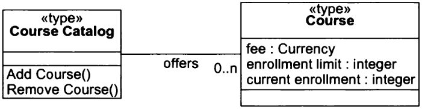

---

MVC Example

Open-Closed Principle (OCP)
===========================

---

Software entities should be open for extension but closed for modification

---

'O' in SOLID

---

Open for extension
------------------

Behavior of a module can be extended as requirements change. We can change what a module does.

Closed for modification
-----------------------

Extending behavior does not result in changes to the source or binary code of the module

---

How is this possible?

---

Abstraction
-----------

Abstract base classes

---

Software is changed by adding code rather than changing existing code

---

Example
-------

---

Wrong:

```python
class Animal():
  def walk():
    if self.type == 'cat':
      self.position += 5
    elif self.type == 'dog':
      self.position += 15
    else:
      self.position += 10
```

---

Right:

```python
class Animal():
  ...
  def walk():
    self.position += 10

class Cat(Animal):
  ...
  def walk():
    self.position += 5

class Dog(animal):
  ...
  def walk():
    self.position += 15
```

---

<iframe width="560" height="315" src="https://www.youtube.com/embed/Ryhy7333mqQ" frameborder="0" allow="accelerometer; autoplay; encrypted-media; gyroscope; picture-in-picture" allowfullscreen></iframe>

---

No module can be closed in all contexts.

---

Design Exercise
---------------

- Design the class hierarchy for a poker application
- The application should support online multiplayer and bots
- Your initial design should implement 5 card draw, but your design should follow the OCP to allow extending your application to other poker variants

---


---


