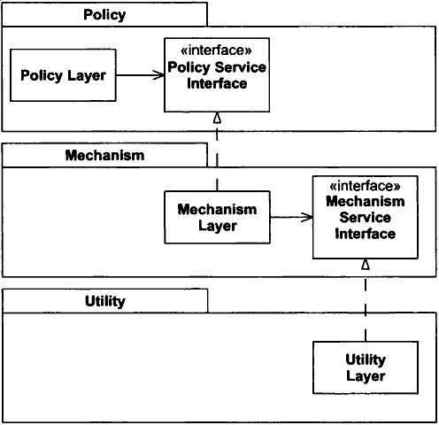

Exam Review
===========

---

Big picture
-----------

- 20 multiple choice questions
- 3 essay questions

Notes
-----

You may bring 1 double-sided sheet of notes with you. It may be no larger than a piece of 8.5x11 US letter paper.

What could you be asked?
------------------------

- Content from class sessions
- Content from textbook
- My intent is to not test you on anything that you wouldn't have learned from *either* the textbook or our class sessions

Multiple choice questions
-------------------------

- Focus on facts
- Give you an opportunity to demonstrate that you understand the terms and basic concepts

Essay questions
---------------

- Focus on application
- Give you an opportunity to demonstrate that you know how to critically apply concepts in new or specific contexts

Essay question content
----------------------

1. Testing
2. Planning
3. Refactoring

---

- Chapter 1 - Agile Practices
- Chapter 2 - Extreme Programming (XP)
- Chapter 3 - Planning
- Chapter 4 - Testing
- Chapter 5 - Refactoring
- Chapter 7 - What is Agile Design?

Liskov Substitution Principle
=============================

Design by Contract
------------------

Specifies expected behaviors that developers can rely on

Unit Testing
------------

Validates that behavior expectations are met

Prototypical Inheritance
========================

---

```javascript
let animal = {
  eats: true
}
let bird = {
  flies: true
}

bird.__proto__ = animal
```

---

```javascript
a = [1, 2]
Array.prototype.first = function () { return this[0] }
a.first()
```

---

```javascript
a = [1, 2]
a.push(3)
console.log(a)
Array.prototype.push = function () { }
a.push(4)
console.log(a)
```

Duck Typing
===========

---

```python
class Duck:
  def quack(self):
    print('quack')

class House:
  def quack(self):
    print('quack')
```

---

```python
class Test:
    def __getitem__(self, i):
        return i

test = Test()
print(test[4])
print(test[5])
```

Traits
======

Dependency-Inversion Principle (DIP)
====================================

---

"D" in SOLID

---

High-level modules should not depend on low-level modules. Both should depend on abstractions.

---

Abstractions should not depend on details. Details should depend on abstractions.

---

> ...all well-structured object-oriented architectures have clearly defined layers, with each layer providing some coherent set of services though a well-defined and controlled interface.

---


Problems
--------

- Depending on lower layers can cause higher layers to break
- Higher layers may be less reusable

---



---

Lower-level modules implement interfaces that are owned by higher-level modules

---

Depend on abstractions
----------------------

- No variable should hold a reference to a concrete class
- No class should derive from a concrete class
- No method should override an implemented method of any of its base classes

---

More like guidelines than actual rules

---
