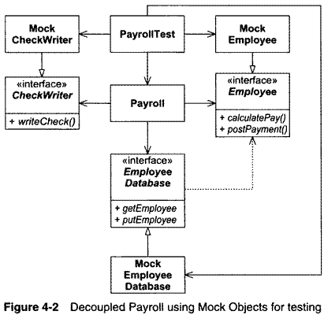

Testing
=======

---

The act of writing a unit test is more an act of design than of verification.

---

The act of writing a unit test is more an act of documentation that of verification.

Test Driven Development
=======================

---

Write tests first

---

No code is written except that which is written to make tests pass

Outcomes
--------

- Every function is testable
- Every function has tests
- Functions are conveniently callable

Benefits
--------

- We know when we break something
- We feel more free to make changes
- Architecture is simpler
- Architecture is decoupled

---

The act of writing tests is an act of discerning between design decisions.

Test Isolation
--------------

- Writing tests first encourages decoupling

---

Acceptance Tests
----------------

- Unit tests verify small elements of the systems (function, etc)
- Acceptance tests verify stories and features

Acceptance Test Example
=======================

Refactoring
===========

---

Changing structure without changing behavior

Purpose of a Module
-------------------

- Perform its task correctly
- Afford change
- Communicate to readers

Refactoring Example
===================
